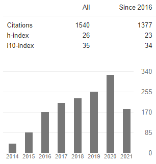
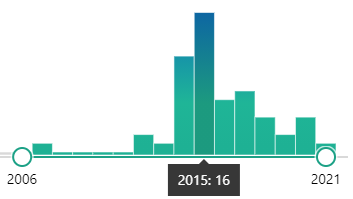
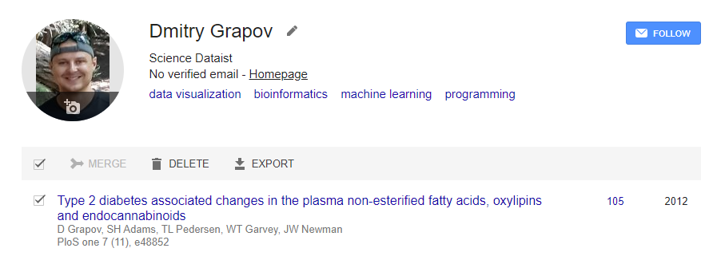
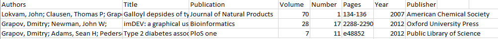
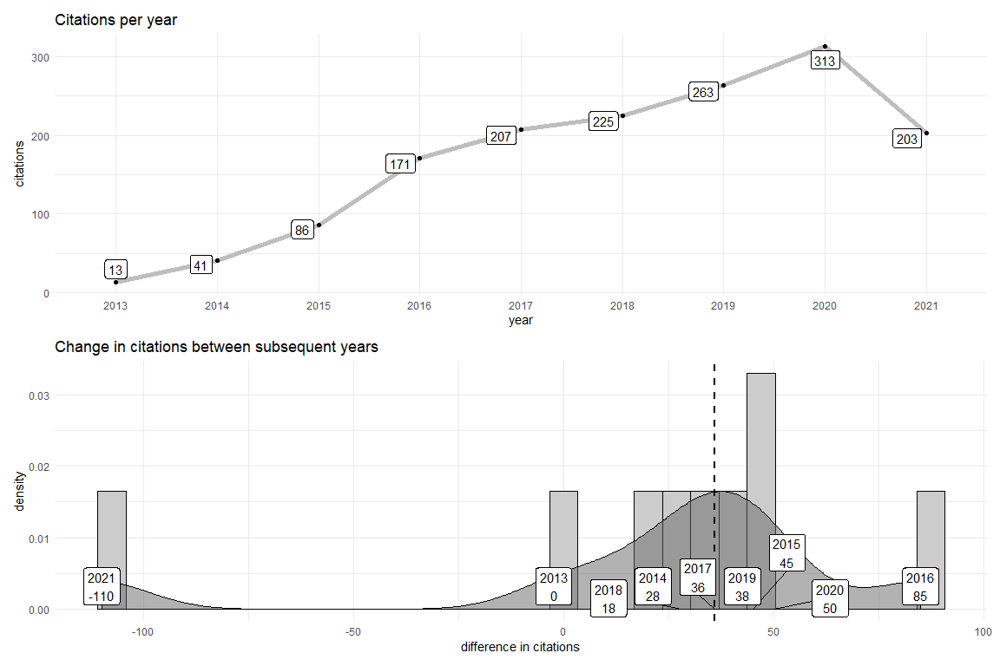
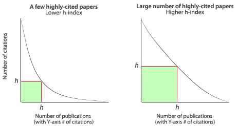

#### Hello world, it’s been a while since I last blogged but I never stopped my external opinings on data analysis and visualization. I published my last blog post on September 2, 2018 which highlighted the [Rise of Deep Learning for Genomic, Proteomic, and Metabolomic Data Integration in Precision Medicine](https://www.liebertpub.com/doi/10.1089/omi.2018.0097). 

<center></center>

#### The image above shows the brave new world where multi-modal transfer learning is used to encode and combine `learnings` of common features (e.g. signal transduction) patterns at varying levels of biological complexity. This sounds almost as pie in the sky as combining machine vision and language translation to make a better video processing model. Surprisingly this can work, and later I might opine on why this is difficult to do on biological data.
#### While its good to dream, I’ve yet satisfactorily apply deep learning model on biological data in a `production` setting, but more on that later. 

<center></center>

#### The figure above draws parallels between biological signal transduction mechanisms and components of deep learning (DL) model architectures. If you have ever studied hyperbolic geometry, the emergence of common stable communication patterns between living organisms and mathematical constructs might not surprise you.

#### In 2018 I was a few years removed from working with a stealth start-up (at that point) seeking to quantify the human health phenotype. I had spent a lot of time crawling various biological databases weaving association, interaction, causality and knowledge networks to try to connect all things medical records, health care lab measurements and omics phenotyping data. This was an arduous task writing `SQL` glue, scrapping webpages and studying `RDF` graphs. Taking breaks from hot gluing data munging pipelines, I dreamed of the day when deep learning platforms can help do all of this and I can instead spend all of my time modeling and visualizing juicy nuggets of biological insights.

<center></center>

#### Fast forward in time, next I would like to consider my peer-reviewed publication record by looking at Google scholar stats. Since then, I’ve continued to write about the evolving field of Omics data analysis and visualization. Looking at [google scholar]( https://scholar.google.com/citations?user=zfp5U0QAAAAJ&hl=en), it is a miracle that I’ve been lucky enough to continue meeting amazing collaborators who have helped supply a heaping serving of complex data to feed the journey in pursuit of honing the art of data analysis and visualization. 


#### I published [my first peer reviewed manuscript](https://pubs.acs.org/doi/abs/10.1021/np060491m) in 2007 while working as an undergraduate chemist in a chemical ecology lab at the University of Utah where I fell in love with analytical chemistry and was inspired to pursue PhD training in analytical chemistry and biotechnology. My [first first author publication](https://scholar.google.com/scholar?oi=bibs&cluster=15071776657322167233&btnI=1&hl=en) was in 2012 during my [PhD dissertation](https://www.proquest.com/docview/1112842674/4EE57D0CF9044C62PQ/1) when I met my true love, data analysis and visualization. Note if my wife reads this, I met my TRUE love in 2004 when still an undergrad. 

#### Enough with the introduction lets look at some data. The graph below shows the number of citations of manuscripts I’ve co-authored since 2014 (which at the time of writing was 1540). A few questions might come to mind like:

#### **1.** How can we validate that this data is correct?
#### **2.** How do we get the raw data used for the graph?
#### **3.** What are the trends for total and change in citations per year?
#### **4.** How can we quantify the quality of the publication record?

#### **1.** Can we trust this data? We could look at another source of record like pubmed and search for [all publications of a specific author](https://pubmed.ncbi.nlm.nih.gov/?term=grapov&sort=relevance).


#### The image above shows total publications by year and highlights a spike of 16 manuscripts in 2015. This is the year I left academia to pursue my [first industry job]( https://www.linkedin.com/in/dmitrygrapov/). In total, pubmed lists 51 publications which is the same order of magnitude as the 34 open source articles linked on Google scholar (P.S. Did you know that an author has to sometimes pay extra to make their articles available outside of paywalls?). Based on this info we can conclude that this data is OK to analyze further. 

#### **2.** How do we get the raw Google scholar data? Trying the UI we almost have hope to export the data as shown. 



#### However, Google only returns information about the manuscripts.



#### If we want the citations we need to [scrape their table](https://github.com/jkeirstead/scholar/blob/b501fe20dab5c6e8079089eb1b7ecd45d961eda7/R/publications.r#L82). Luckily there is an [R package]( https://github.com/jkeirstead/scholar) to do this for us. Lets look at some code to pull this data.

#### We can get the Google scholar author id from the user field in the URL. For example, for `https://scholar.google.com/citations?user=zfp5U0QAAAAJ&hl=en` the id is ` zfp5U0QAAAAJ`.

#### Lets check that this id is correct.

```r
# install.packages("scholar")
library(scholar)

id<-'zfp5U0QAAAAJ'

# Get profile verify the author's name
l <- get_profile(id)
l$name 
```

```
## [1] "Dmitry Grapov"
```

#### This correctly returns the author. Next we can get the number of citations by year.


```r
# Get the citation history
(citations<-get_citation_history(id))
```

```
##   year cites
## 1 2013    13
## 2 2014    41
## 3 2015    86
## 4 2016   171
## 5 2017   207
## 6 2018   225
## 7 2019   263
## 8 2020   313
## 9 2021   203
```

#### **3.** Next let’s look at the change in citations per year. Ideally all author publications are getting cited each year which could be a sign of relevance or primary reference of a useful idea. If this is the case, we expect a positive increase in the change in the number of citations per year (not unlike compound interest).


```r
citations$delta<-c(0,diff(citations$cites))
median_cites<-median(citations$delta)
citations
```

```
##   year cites delta
## 1 2013    13     0
## 2 2014    41    28
## 3 2015    86    45
## 4 2016   171    85
## 5 2017   207    36
## 6 2018   225    18
## 7 2019   263    38
## 8 2020   313    50
## 9 2021   203  -110
```

#### From 2007 to now, my publications have received a median of 36. That sounds reasonable but lets look if the median is a good summary of the trend.


```r
library(ggplot2)
library(ggrepel)
library(tidyr)
library(dplyr)
library(patchwork)

#lets make an overloaded label
citations<- citations %>% 
  unite('label',c(year,delta),remove=FALSE, sep='\n')

p1<-ggplot(citations, aes(x=delta)) + 
  geom_histogram(aes(y=..density..), colour="black", fill="gray80") +
  geom_density(alpha=.5, fill="gray40") +
  geom_vline(aes(xintercept=median_cites), color="black", linetype="dashed", size=1) +
  geom_label_repel(aes(x=delta,y=0,label=label)) +
  xlab('difference in citations') + 
  ggtitle('Change in citations between subsequent years') +
  theme_minimal()

p2<-ggplot(citations %>% mutate(year=factor(year)), aes(x=year, y=cites,group='1')) + 
  geom_line(color='gray',size=2) +
  geom_point() +
  ggtitle('Citations per year') +
  geom_label_repel(aes(x=year,y=cites,label=cites)) +
  xlab('year') +
  ylab('citations') +
  theme_minimal()

p2 / p1
```
<center></center>


#### The figures above show on top, a line plot of total citations per year and on the bottom, a histogram and density plot the differences in citations between subsequent years. Based on this we see a decrease in citations for 2021. This is expected because we are mid year in June and at this rate 2021 will end up with 406 citations or a change of 93. Additionally we see the biggest increase in citations occurred in from 2015 to 2016 which matches my last year in academia.

#### **4.** The `h-index` presents an [interesting summary metric](https://subjectguides.uwaterloo.ca/calculate-academic-footprint/YourHIndex) of an author's ~impact. It tries to normalize the total number of manuscripts v.s. citations per manuscript and places importance on publishing many highly cited manuscripts v.s. a few very highly cited or very many lowly cited papers.



#### Fast forward to today, 2021-07-01, I am very grateful for being able to experience both academic publishing focused and industry value creation focused projects. Stay tuned for future posts exploring new creative methods to analyze and visualize data.

#### Last updated: 2021-07-01
