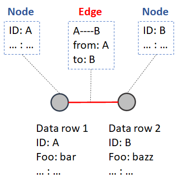
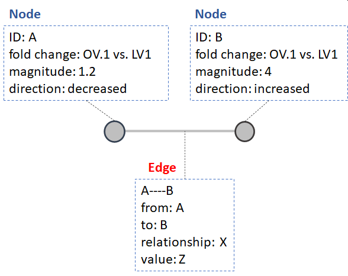
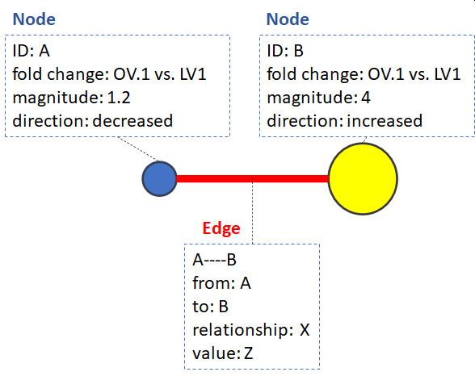
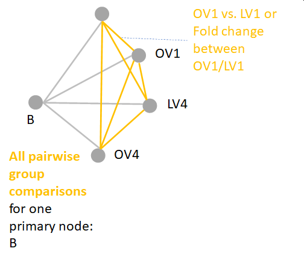
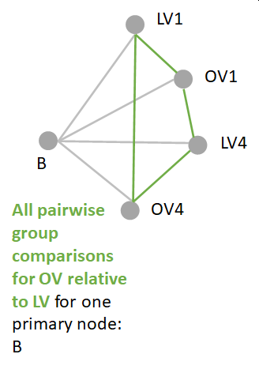
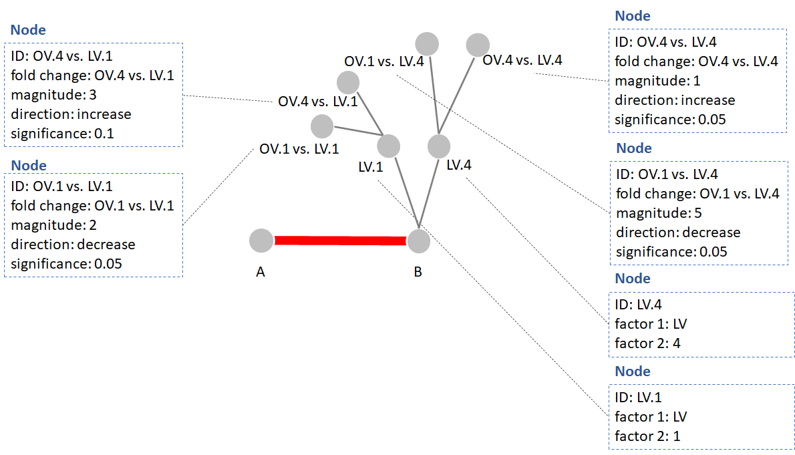
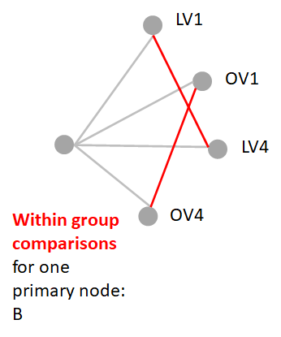
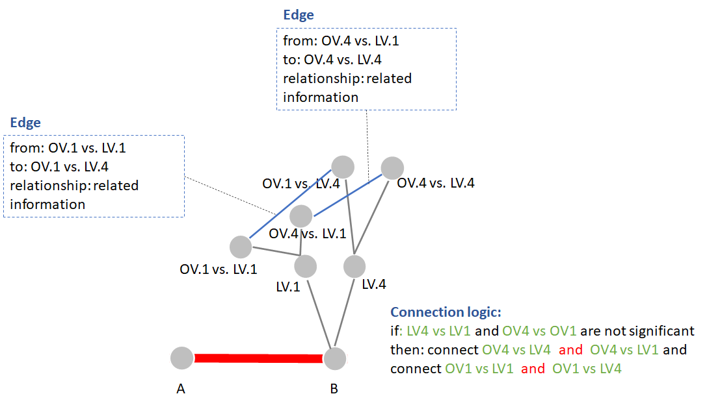
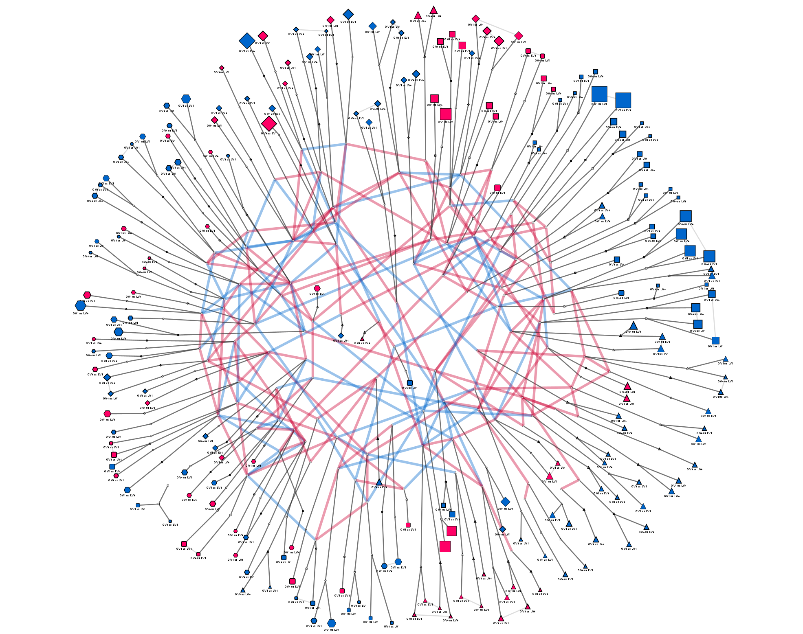

The following details an example how to extend network structures to encode multiple pairwise comparisons through the application of hyper edges and establishing statistical reference groups.

Networks can uniquely store data and relationships. This is done using two main data structures 1) node attributes (data) and 2) relationships among nodes or edges (connections) storing information about the relationships between the nodes. Nodes or vertices represent the main data (rows) information and edges encode relationship between nodes. 

<p style="text-align:center;"></p>

This translates to the following data structures.

***Nodes:***


```
##   ID  Foo
## 1  A  bar
## 2  B bazz
```
***Edges:***

```
##   from to
## 1    A  B
```

This encodes information about each node or row  and edges or relationships between rows. This becomes a powerful approach to analyze and visualize the data.

We can now store information about the primary entities (data rows) and their relationship s (e.g. correlation, biological or empirical association, etc.).

Lets imagine the next question. How to do we show the differences between `two` factors,`type` and `time` and their interaction. 

Each of the factors can have `n` levels.


```
##   type time
## 1   OV    1
## 2   LV    4
```

The simplest solution requires the following comparisons.


```
##   type time
## 1   OV    1
## 2   LV    1
## 3   OV    4
## 4   LV    4
```

Which if we have all comparisons is a total of 6 edges or pairwise comparisons. The simplest network shows one pairwise comparisons  or OV1 vs. LV1. A  single pairwise comparison can be encoded in a single network as nodes showing the significance and fold change between one level of node type and time  e.g. type OV vs. LV and time 1.

This could entail the following data structure showing the comparison between two primary node`ID`'s `A` and `B`.

```
##   ID type time
## 1  A   OV    1
## 2  B   OV    1
## 3  A   LV    1
## 4  B   LV    1
## 5  A   OV    1
## 6  B   OV    1
## 7  A   LV    1
## 8  B   LV    1
```

We can encode the relationship between `A` and `B` in the edges.


```
##   from to ...
## 1    A  B ...
```
In this example `... : ...` encodes any `key` : `value` pairs encoding information about the relationship type between `A` and `B` e.g. biochemical, structural, empirical, etc. This simplifies the visualization of the question to the following.

<p style="text-align:center;"></p>

The fold changes can be encoded in the node color (direction, decrease or increase) and size in the magnitude.

<p style="text-align:center;"></p>

If we want to expand this to another level of time  e.g. 4, we can either make two pairwise networks (time =1 and time = 4) or use hyper edges two encode both in one.

Lets see how we can encode the following comparisons with in a single network.

```r
(comps<-expand.grid(node = 'B','factor 1'= c('OV','LV'),'factor 2' = c(1,4)))
```

```
##   node factor 1 factor 2
## 1    B       OV        1
## 2    B       LV        1
## 3    B       OV        4
## 4    B       LV        4
```

We can combine the two factors to set up the following data for pairwise comparisons.


```r
library(tidyr)
groups<-unite(comps,'comp',c('factor 1','factor 2'),sep='.')
groups
```

```
##   node comp
## 1    B OV.1
## 2    B LV.1
## 3    B OV.4
## 4    B LV.4
```

This can be visualized as the following.

<p style="text-align:center;"></p>

All pairwise comparisons can be visualized as the following.

<p style="text-align:center;"></p>

We can set a reference level for our comparisons to `factor 1: LV`. This can be visualized as the following comparisons.

<p style="text-align:center;"></p>

This sets up the following reduced pairwise comparisons. 


```
##      [,1]           
## [1,] "OV.1 vs. LV.1"
## [2,] "OV.1 vs. LV.4"
## [3,] "LV.1 vs. LV.4"
## [4,] "OV.4 vs. LV.4"
```

This can be shown as the following network nodes and edges.

<p style="text-align:center;"></p>

Next we can add the relationships between the main comparison nodes, which might look like the following.

<p style="text-align:center;"></p>

We can define the edge relationships based on a variety of criteria. In the following example we can show when the comparisons between the groups are insignificant or the nodes don't convey unique information. The logic for this can be defined as the following.

<p style="text-align:center;"></p>

Putting all together involves two main steps 1) calculate a network showing relationships between all primary nodes and 2) calculate and add the pairwise comparison edges to the primary network. The final results might look complciated at first but this is the result of compressing ~6 pairwise comparison networks into one!

<p style="text-align:center;"></p>

This network's nodes also encode quite a bit of primary and secondary node data, but I'll leave the explanation for how this is done for another post.


