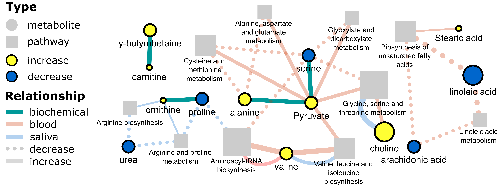

 

Network mapping was used to visualize the association between significantly enriched pathways and evidence of association with a disease state. I will have to keep things vague untill the official manuscript is published.

The data consists of counts of reference manuscripts observing an association of significant changes in metabolites in disesed compared to a control state in blood, saliva and urine. Metabolite KEGG identifiers were used to calculate pathway enrichment separately for each tissue using MetaboAnalyst [ref]. Significantly enriched pathways were identified based on p-valueS ≤ 0.05. 

[Network mapping](10.1093/bioinformatics/btv194) was used to summarize associations between enriched pathways and evidence of metabolite changes in blood, saliva and urine tissues. Evidence of metabolite and disease associations and direction of change (decrease or increase in disease state) were summarized based on their consensus. Consensus was determined based on the addition of the number of observations and their direction (e.g. 2 increased + (-1) decreased = 1 increased association with the disease state). 

The color of the edges defines the connection: green, biochemical; red, blood; blue, saliva (nothing was enriched for urine). The line type shows if the relationship was an increase (solid) or decrease (dotted). Biochemical relationships between metabolites were determined based on [KEGG define reactant and product pairs](https://github.com/dgrapov/metabomapr/). Node size for metabolites encodes the number of consensus observations. The size of the pathway nodes summarizes the number of consensus observations significantly enriched for each pathway. The color of the nodes shows the direction of the consensus observation (e.g. blue, decrease; yellow, increase). The network was visualized using [cytoscape](https://cytoscape.org/).

I hope this example shows the power of network mapping for displaying complex data relationships. Happy network mapping!
