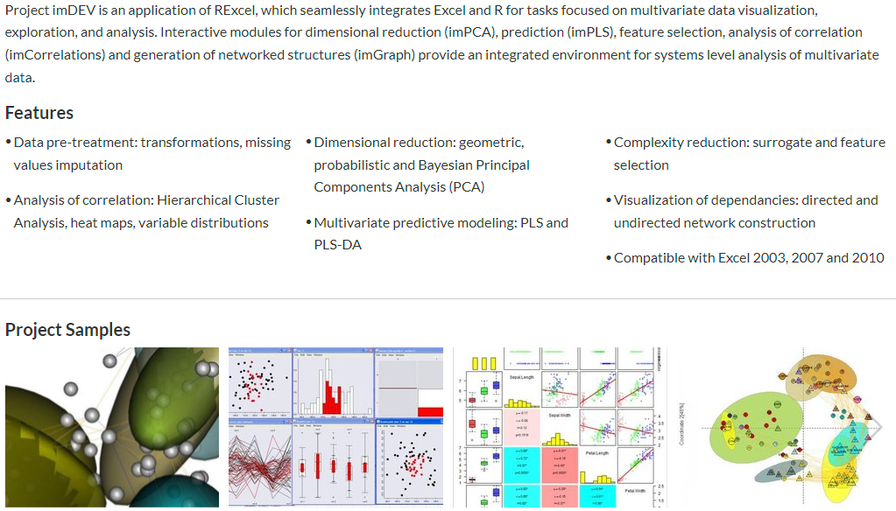
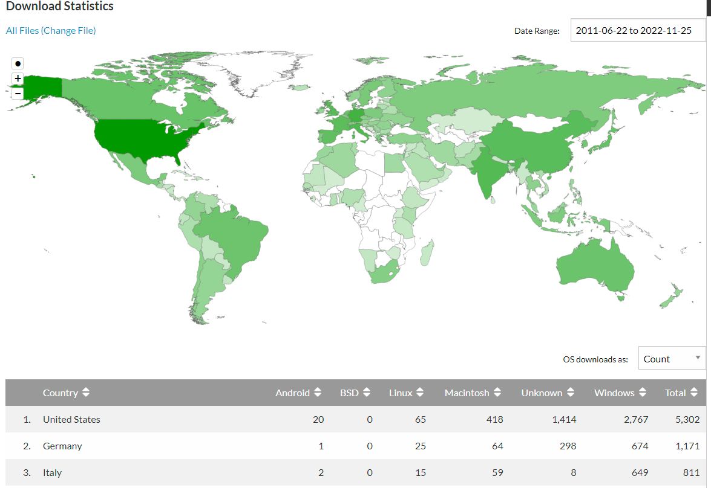
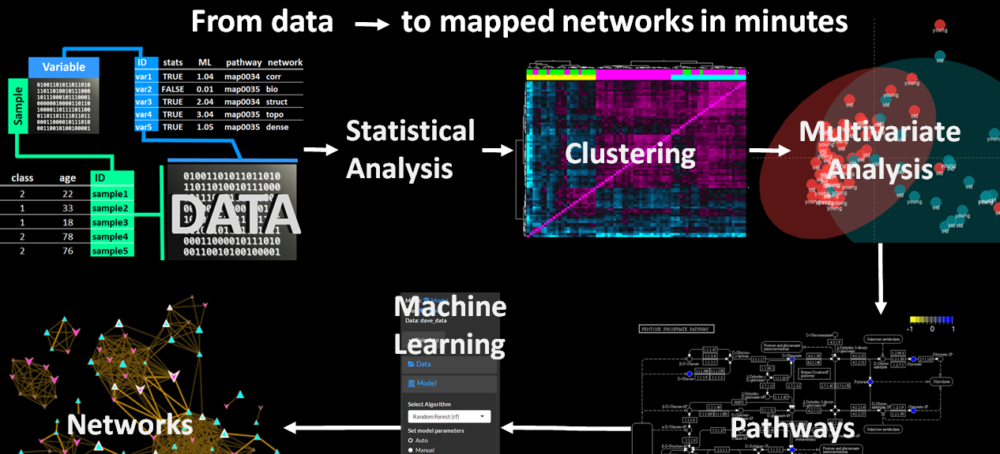

# [Network mapping 101](https://creativedatasolutions.github.io/CDS.courses/courses/network_mapping_101/docs/) course in review

### Course Organization

This October I was lucky enough to teach an advanced metabolic data analysis course in collaboration [University of California, Davis](https://deb.ucdavis.edu/).

The goal was to create the following network.

The course covered all of the steps required to go from `raw data` to a rich `mapped biochemical network` incorporating statistical, multivariate and machine learning results. This included [examples](https://creativedatasolutions.github.io/CDS.courses/courses/network_mapping_101/docs/#topics) and tutorials for:

* Preparing raw data for analysis
* Multivariate data exploration
* Supervised clustering
* Machine learning – classification model validation and feature selection
* Network analysis - biochemical, structural similarity and correlation networks
* Network mapping – putting it all together to create a publication quality network

### Course Software

During this course, the participants used [DAVe](https://creativedatasolutions.github.io/dave.docs/) - Data Analysis and Visualization engine to recreate all analyses results. The final networks were rendered using [Cytoscape](https://cytoscape.org/) and prepared for publication using [Inkscape](https://inkscape.org/).

### Development

This course was a great motivator to push [CDS](https://creative-data.science/) software development to release the first free publicly available version of [DAVe](https://creativedatasolutions.github.io/dave.minicran/).

#### Quick history of `DAVe`

The current iteration of `DAVe` is the culmination of a long journey which began around the year `2010`.
Everything started when [I](https://dgrapov.github.io/Dmitry-Grapov/) was first exposed to programming. This occurred while I was completing my PhD [graduate](https://agchem.ucdavis.edu/) work at [UC Davis](https://www.ucdavis.edu/). While I was working on my PhD thesis on [Application of Targeted Metabolomic Profiling and Multivariate Data Analysis for the Study of Nutrition and Disease](https://www.proquest.com/openview/7bfbe4fc3ec66a8cb4ef464bcfa15d86/1.pdf?pq-origsite=gscholar&cbl=18750). I took a statistical analysis course which was taught in [R](https://cran.r-project.org/). I fell in love with `coding` and my PhD quickly included building multivariate data analysis `add-ins for Excel`. The first iteration was a Frankenstein of `visual basic` and `R`. [ImDEV](https://sourceforge.net/projects/imdev/) - `I`nteractive `m`odules for `D`ata `E`xploration and `V`isualization was born. 

I am overjoyed that this tool has been [downloaded](https://sourceforge.net/projects/imdev/files/stats/map?dates=2011-06-22+to+2022-11-25) in `131` countries over `16,000` times.

Looking back, I am very grateful for the opportunity to blindly learn to recreate countless `wheels` (no CS training, machine learning or IDE with syntax highlighting). 

While `ImDEV` was powerful and unique (is there any other way to create 3D networks in excel?) it was hard to install and even harder to maintain for the many possible versions of `Excel`. 

Next, [DeviumWeb](http://dgrapov.github.io/DeviumWeb/) - `D`ynamic Multivariat`E` Data Analysis and `VI`s`U`alization Platfor`M` was born. This tool used `R` and the package [shiny](https://shiny.rstudio.com/) to create all of the `UI`.

While `Devium` was portable, it was still hard to install, requiring many `R` packages including those from [Bioconductor](https://www.bioconductor.org/). `Devium` also lacked integration with network calculation tools I created such as [MetaMapR](http://dgrapov.github.io/MetaMapR/). 

[DAVe](https://creativedatasolutions.github.io/dave.docs/) was made to easily execute the full metabolomic network mapping [workflow](https://creativedatasolutions.github.io/dave.docs/partial/workflows.html#full-workflow). This tool uses a combination of [OpenCPU](https://www.opencpu.org/) microservices and a `shiny` `UI`. This makes it easier to [install](https://creativedatasolutions.github.io/dave.minicran/) and maintain all of the code.

`DAVe` architecture has gone through many iterations including deployment as a [kubernetes](https://kubernetes.io/) backed [ShinyProxy](https://www.shinyproxy.io/) application before arriving at its current form. My hope is that the current iteration combining `API microservices` and local `shiny UI` will provide the best compromise between user experience, rapid development and ease of maintenance. 

While `DAVe` is an awesome tool, it requires upkeep. If you like this tool, please consider [supporting it](https://www.patreon.com/user?u=83342337), which will help maintain all the servers!

